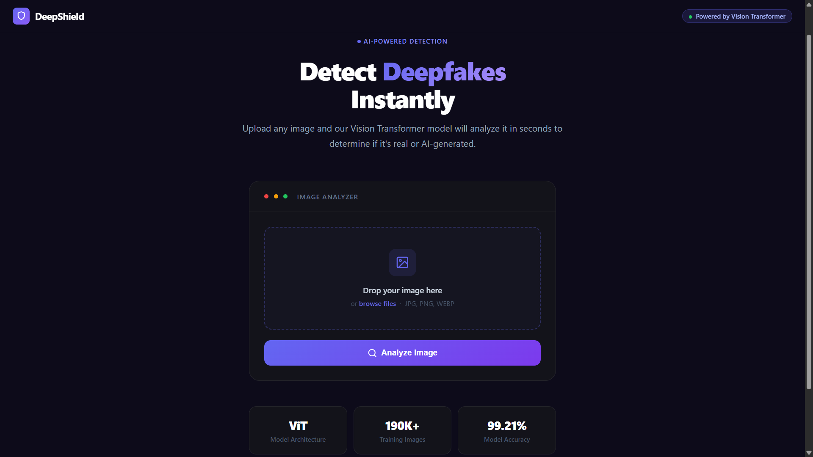
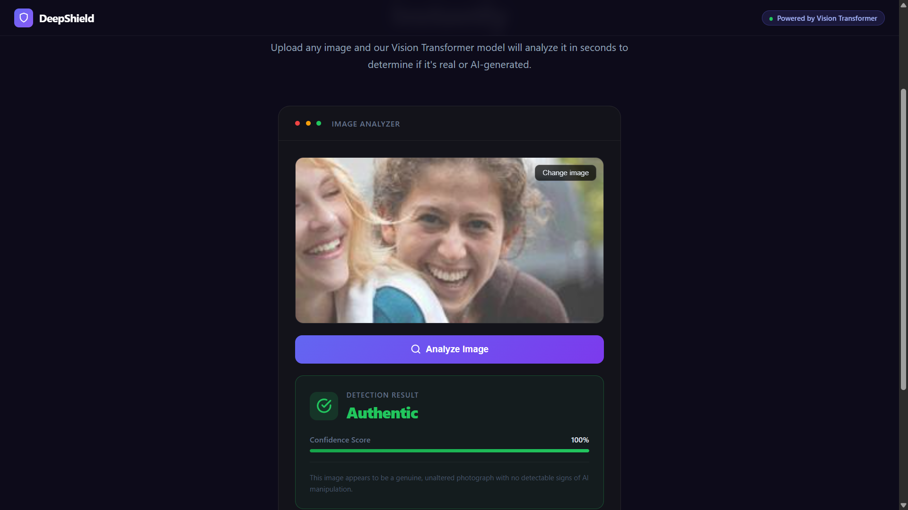
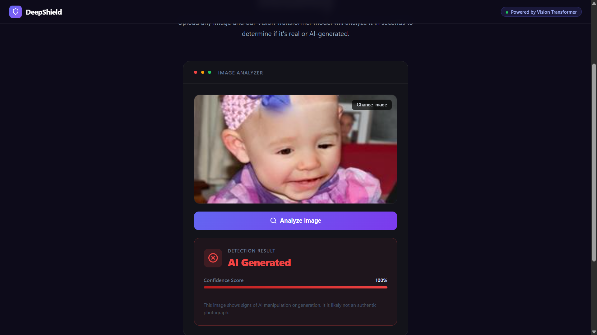

# 🔍 DeepShield — DeepFake Image Detection System

A deep learning-powered web application that detects whether an image is **real or AI-generated (deepfake)** using a fine-tuned Vision Transformer (ViT) model. Upload any image and get an instant prediction with a confidence score.

---

## 🚀 Demo

> Upload an image → Click **Analyze Image** → Get result instantly





---

## 🧠 How It Works

This project uses a **Vision Transformer (ViT)** model fine-tuned on a dataset of 190,000+ real and AI-generated (deepfake) images.

**Pipeline:**
1. User uploads an image via the web UI
2. Flask backend receives the image and preprocesses it using `ViTImageProcessor`
3. The ViT model runs inference and returns logits
4. A softmax layer converts logits to confidence scores
5. The result (`Authentic` or `AI Generated`) along with confidence % is returned to the frontend

---

## 🏗️ Project Structure

```
deepfake-detection/
│
├── app.py                        # Flask backend — prediction API & web server
├── image_deepfake_detection.py   # Model training & evaluation script
├── requirements.txt              # Python dependencies
├── .gitignore                    # Files excluded from GitHub
├── README.md                     # Project documentation
│
├── templates/
│   └── index.html                # Frontend UI (HTML/CSS/JS)
│
├── screenshots/                  # Demo screenshots for README
│
└── deepfake_vs_real_image_detection/   # Saved fine-tuned model (download separately)
    └── checkpoint-7141/
```

---

## ⚙️ Tech Stack

| Layer | Technology |
|---|---|
| Model | `ViTForImageClassification` (Vision Transformer) |
| Pre-trained Base | `dima806/deepfake_vs_real_image_detection` (HuggingFace) |
| Training Framework | HuggingFace `Transformers` + `Trainer` API |
| Backend | Python, Flask |
| Frontend | HTML, CSS, Vanilla JavaScript |
| Deep Learning | PyTorch |
| Data Handling | HuggingFace `datasets`, `imbalanced-learn` |

---

## 📦 Installation

### 1. Clone the repository

```bash
git clone https://github.com/GauravShah81/DeepFake-Image-Detection-System.git
cd DeepFake-Image-Detection-System
```

### 2. Create a virtual environment (recommended)

```bash
python -m venv venv
source venv/bin/activate        # On Windows: venv\Scripts\activate
```

### 3. Install dependencies

```bash
pip install -r requirements.txt
```

---

## 🤖 Download the Trained Model

The trained model is too large for GitHub. Download it separately and place it in the project root.

> 📥 **[Download Model from HuggingFace](https://huggingface.co/GauravShah81/deepfake-vs-real-image-detection)**

After downloading, your structure should look like:
```
deepfake-detection/
└── deepfake_vs_real_image_detection/
    └── checkpoint-7141/
            ├── config.json
            ├── model.safetensors
            └── preprocessor_config.json
```

---

## 📂 Dataset

The model was trained on 190,000+ real and AI-generated images.

> 📥 **[Download Dataset from Kaggle](https://www.kaggle.com/datasets/manjilkarki/deepfake-and-real-images)**

---

## 🏋️ Training the Model (Optional)

If you want to retrain the model yourself:

### 1. Prepare the dataset

```
Dataset/
├── real/
│   ├── image1.jpg
│   └── ...
└── fake/
    ├── image1.jpg
    └── ...
```

### 2. Run the training script

```bash
python image_deepfake_detection.py
```

**Training Configuration:**

| Parameter | Value |
|---|---|
| Epochs | 1 |
| Batch Size | 16 |
| Learning Rate | 5e-5 |
| Weight Decay | 0.02 |
| Warmup Steps | 100 |
| Precision | FP16 (GPU) |
| Test Split | 40% |

> 💡 **Tip:** Training locally on a consumer GPU is very slow. It is recommended to use **Google Colab** with a T4 GPU for significantly faster training (~25 minutes vs several hours).

---

## 🌐 Running the Web App

```bash
python app.py
```

Then open in your browser:
```
http://localhost:5000
```

---

## 🖥️ Usage

1. Open the web app in your browser
2. **Drag & drop** or click **browse files** to upload an image (JPG, PNG, WEBP)
3. A preview of the image will appear
4. Click **Analyze Image**
5. The result will display:
   - ✅ **Authentic** (shown in green) — image appears genuine
   - ❌ **AI Generated** (shown in red) — image appears to be AI-generated
   - 📊 **Confidence Score** — how confident the model is in its prediction

---

## 📊 Model Performance

| Metric | Score |
|---|---|
| **Accuracy** | **99.21%** |
| **F1 Score** | **99.21%** |
| Precision (Real) | 99.05% |
| Recall (Real) | 99.38% |
| Precision (Fake) | 99.38% |
| Recall (Fake) | 99.04% |

Trained on **114,241 images**, evaluated on **76,161 images**.

---

## ⚠️ Known Limitations

- **Best on high quality images** — The model performs best on high quality, uncompressed images. Performance may vary on heavily compressed or resized images downloaded from the web, which is a known challenge in deepfake detection research.

- **Human face focused** — The model is primarily trained on human face deepfakes. It may not generalize well to AI-generated animal images, landscapes, or complex multi-subject scenes. This is an "Out of Distribution" problem common across deepfake detection research.

- **Domain shift** — Images from the training dataset distribution are detected with high accuracy. Real-world images from different sources may show reduced accuracy due to differences in compression, resolution, and image quality — a well-known challenge even in state-of-the-art research.

- **Evolving threat** — As AI image generation technology (Midjourney, DALL-E, Stable Diffusion) continues to improve, detection models require continuous retraining on newer data to remain effective.

---

## 🔌 API Reference

### `POST /predict`

Accepts an image file and returns a prediction.

**Request:**
```
Content-Type: multipart/form-data
Body: image=<image_file>
```

**Response:**
```json
{
  "prediction": "real",
  "confidence": 0.9823
}
```

**Error Response:**
```json
{
  "error": "No Image file found in the request"
}
```

---

## 🙏 Acknowledgements

- Pre-trained base model: [dima806/deepfake_vs_real_image_detection](https://huggingface.co/dima806/deepfake_vs_real_image_detection) on HuggingFace
- Built with [HuggingFace Transformers](https://huggingface.co/docs/transformers)
- Vision Transformer architecture: [An Image is Worth 16x16 Words](https://arxiv.org/abs/2010.11929)

---

## 📄 License

This project is open-source and available under the [MIT License](LICENSE).
